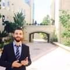

Web Designer.

## Currently

FULL STACK WEB DEVELOPMENT, CODITECH BOOTCAMP, BEIRUT LEBANON

### Specialized in

Mechanical Engineering, Web testing, Web Design

### Research interests

Heating Cooling and Refrigeration, Power Generation, Renewable Energy and Web Development 

## Education

`2013-2018`
_LEBANESE AMERICAN UNIVERSITY,BYBLOS__
- MECHANICAL ENGINEERING 

 `2019-2020`
_ARTS ET METIER,PARISTECH,LILLE,FRANCE__
- MASTE'S DEGREE IN ADVANCED PRODUCTION SYSTEMS

## Occupation

`2018`
- PRODUCTION SUPERVISOR, ZAHLE, LEBANON
- MASTER CHIPS

`2019`
- MECHANICAL DESIGNER
- Go Touch VR

`2021-PRESENT`
- FREELANCE ENGINEER

<!-- ### Footer

Last updated: NOVEMBER 2022 -->
